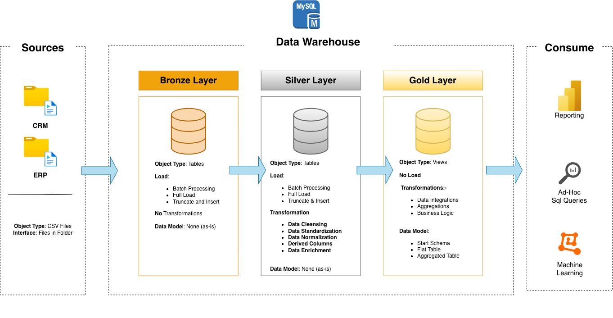

# Data Warehouse Analytics Project - SQL
- This project present a simple and comprehenssive SQL based data warehouse made using two csv files
- a data warehouse is subject oriented, integrated time-variant and non-volatile collection of data in support of management’s decision making process

## Data Warehouse Architecture
- This project follows a Medallion type data warehouse with three intermediate layers and two input/output layers (diagram attached below)

